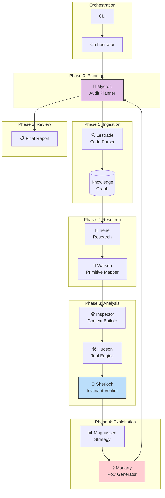

<div align="center">

# 🔍 Sherlock

**Agentic Smart Contract Security Auditing Framework**

[](https://www.python.org/downloads/)
[](LICENSE)

*"When you have eliminated the impossible, whatever remains,
however improbable, must be the truth."*

</div>

---

Sherlock is an industrial-grade, protocol-agnostic smart contract security framework that orchestrates **specialized AI agents** to perform deep analysis of **Financial Primitives** and **Mathematical Invariants**.

## ✨ Features

| Feature | Description |
|---------|-------------|
| **9 Specialized Agents** | Each with a distinct role in the audit lifecycle |
| **Invariant Engine** | Checks DeFi physics (solvency, conservation, incentives) |
| **PoC Generation** | Automatic Foundry exploit proof-of-concept generation |
| **Knowledge Graph** | Semantic detection and vulnerability pattern matching |

---

## 🏗️ Architecture



---

## 🎭 Agent Roles

| Agent | Role | Responsibility |
|-------|------|----------------|
| **Mycroft** | Auditor of Auditors | Defines audit strategy, reviews final output |
| **Lestrade** | Ingestion | Parses scope, builds knowledge graph |
| **Irene** | Research | Identifies protocol archetype & historical vulnerabilities |
| **Watson** | Perception | Maps code to financial primitives (Vault, Loan, Exchange) |
| **Inspector** | Context Builder | Line-by-line deep analysis of critical code |
| **Hudson** | Tool Engine | Runs slither, aderyn, forge |
| **Sherlock** | Verification | Checks mathematical invariants |
| **Magnussen** | Strategy | Identifies systemic design flaws |
| **Moriarty** | Exploitation | Generates Foundry PoC exploits |

---

## 📁 Project Structure

```
sherlock/
├── src/sherlock/
│   ├── agents/           # 9 specialized agents
│   │   ├── mycroft.py    # Audit planner/reviewer
│   │   ├── irene.py      # Research agent
│   │   ├── watson.py     # Primitive mapper
│   │   ├── sherlock.py   # Invariant verifier
│   │   └── ...
│   ├── core/             # Orchestration & utilities
│   │   ├── orchestrator.py
│   │   ├── db.py         # Knowledge graph
│   │   └── semantic_detector.py
│   ├── logic/            # Invariant engine
│   │   └── invariant_engine.py
│   └── templates/        # Jinja2 PoC templates
├── docs/                 # Documentation
├── examples/             # Example audit outputs
└── scripts/              # Setup utilities
```

---

## 🚀 Quick Start

```bash
# Clone the repository
git clone https://github.com/saurabh-awate96/sherlock.git
cd sherlock
git checkout sherlock-mycroft

# Install dependencies
pip install -e .

# Install audit tools (slither, aderyn, forge)
./scripts/install_tools.sh

# Run an audit
python -m sherlock.core.orchestrator --target <repo_url>
```

---

## 🔬 Invariants Checked

The framework verifies fundamental **DeFi Physics**:

| Invariant | Formula | Description |
|-----------|---------|-------------|
| **Solvency** | `Assets >= Liabilities` | Protocol must remain solvent |
| **Conservation** | `ΔWealth == ΔExternalFlows` | Value cannot be created or destroyed |
| **Incentive** | `Reward > Cost` | Actions must be economically rational |
| **Share Integrity** | No inflation/deflation attacks | Token accounting must be accurate |

---

## 📖 Documentation

- [Architecture Details](docs/ARCHITECTURE.md)
- [Agent Reference](docs/AGENTS.md)
- [Quick Start Guide](docs/QUICKSTART.md)

---

## 📄 License

This project is licensed under the MIT License - see the [LICENSE](LICENSE) file for details.

---

<div align="center">

*Built with 🔍 for the science of deduction*

</div>
